# ONAIR (AI 뉴스 요약 서비스)

---

## 📃 카테고리

| Domain                                | Language                         | Framework                            |
| ------------------------------------- | -------------------------------- | ------------------------------------ |
| :white_check_mark: AI              | :white_check_mark: JavaScript    | :black_square_button: Vue.js         |
| :black_square_button: Big Data        | :white_check_mark: TypeScript | :white_check_mark: React             |
| :black_square_button: Blockchain      | :black_square_button: C/C++      | :black_square_button: Angular        |
| :black_square_button: IoT             | :black_square_button: C#         | :black_square_button: Node.js        |
| :black_square_button: AR/VR/Metaverse | :white_check_mark: Python     | :white_check_mark: FastAPI   |
| :black_square_button: Game            | :white_check_mark: Java          | :white_check_mark: Spring/Springboot |
|                                       | :black_square_button: Kotlin     |                                      |

---

## 💡 프로젝트 소개

`ONAIR`는 '바쁜 현대사회 빠르게 뉴스를 보자' 라는 슬로건을 내세운 서비스 입니다.

> 작성된 뉴스 기사를 AI가 직접 요약해서 보여줍니다

---

## 🔧 서비스 아키텍쳐

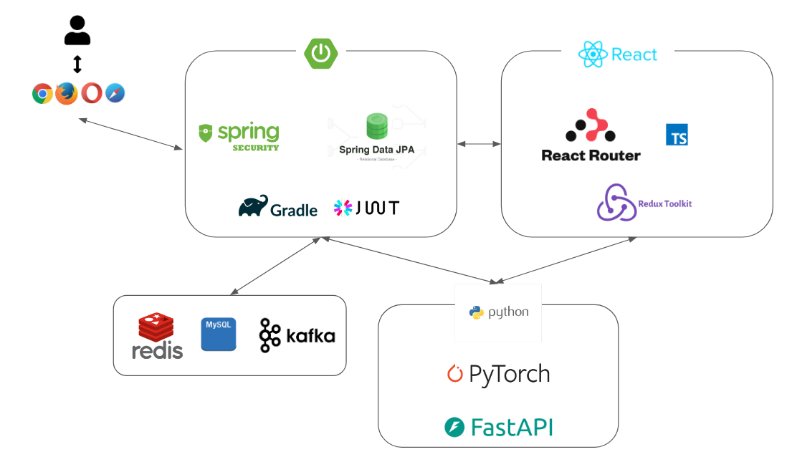

---

## 🎨 ERD & 와이어 프레임

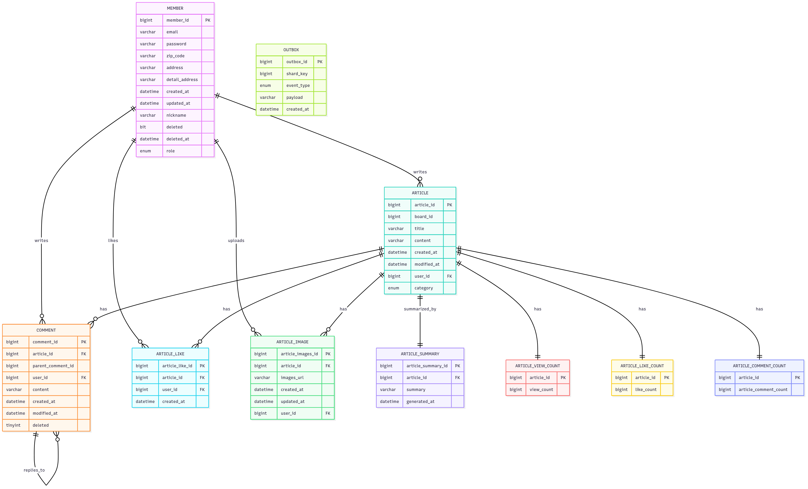

---

## 🔎 기술 소개

#### 메인페이지&nbsp;&nbsp;&nbsp;&nbsp;&nbsp;&nbsp;&nbsp;&nbsp;&nbsp;&nbsp;&nbsp;&nbsp;&nbsp;&nbsp;&nbsp;&nbsp;&nbsp;&nbsp;&nbsp;&nbsp;&nbsp;&nbsp;&nbsp;&nbsp;&nbsp;&nbsp;&nbsp;&nbsp;&nbsp;&nbsp;&nbsp;&nbsp;&nbsp;&nbsp;&nbsp;&nbsp;&nbsp;&nbsp;&nbsp;&nbsp;&nbsp;&nbsp;&nbsp;&nbsp;&nbsp;&nbsp;&nbsp;&nbsp;&nbsp;&nbsp;카테고리

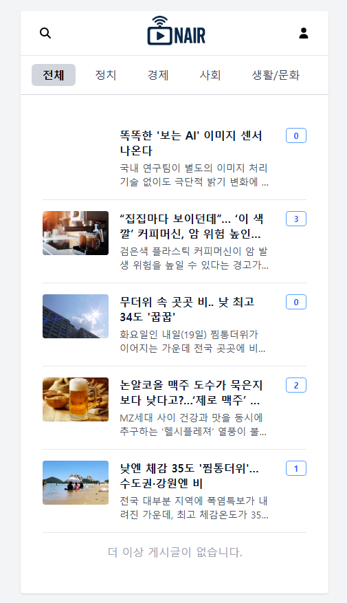&nbsp;&nbsp;&nbsp;&nbsp;&nbsp;&nbsp;&nbsp;&nbsp;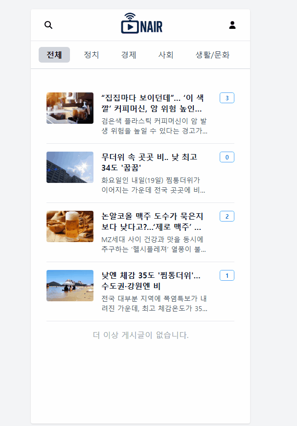  

> 메인페이지에서는 전체 뉴스를 바로 볼 수 있고, 현재 댓글 개수를 확인할 수 있습니다.
>
> 상단에 있는 슬라이더를 통해 원하는 뉴스 카테고리에 접근할 수 있습니다.

#### 회원가입&nbsp;&nbsp;&nbsp;&nbsp;&nbsp;&nbsp;&nbsp;&nbsp;&nbsp;&nbsp;&nbsp;&nbsp;&nbsp;&nbsp;&nbsp;&nbsp;&nbsp;&nbsp;&nbsp;&nbsp;&nbsp;&nbsp;&nbsp;&nbsp;&nbsp;&nbsp;&nbsp;&nbsp;&nbsp;&nbsp;&nbsp;&nbsp;&nbsp;&nbsp;&nbsp;&nbsp;&nbsp;&nbsp;&nbsp;&nbsp;&nbsp;&nbsp;&nbsp;&nbsp;&nbsp;&nbsp;&nbsp;&nbsp;&nbsp;&nbsp;로그인 & 회원정보 수정

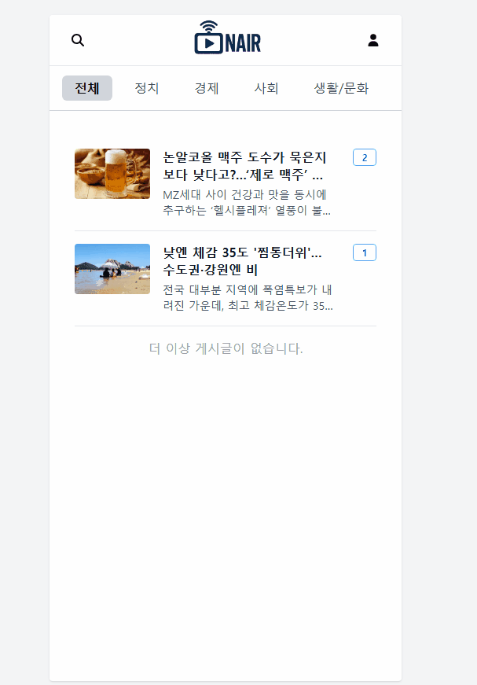&nbsp;&nbsp;&nbsp;&nbsp;&nbsp;&nbsp;&nbsp;&nbsp;  

> 사용자는 유효성 검증을 통해 회원가입을 진행하고 로그인 할 수 있습니다.
>
> 기자와 일반으로 구분해 가입할 수 있습니다.

#### 회원탈퇴&nbsp;&nbsp;&nbsp;&nbsp;&nbsp;&nbsp;&nbsp;&nbsp;&nbsp;&nbsp;&nbsp;&nbsp;&nbsp;&nbsp;&nbsp;&nbsp;&nbsp;&nbsp;&nbsp;&nbsp;&nbsp;&nbsp;&nbsp;&nbsp;&nbsp;&nbsp;&nbsp;&nbsp;&nbsp;&nbsp;&nbsp;&nbsp;&nbsp;&nbsp;&nbsp;&nbsp;&nbsp;&nbsp;&nbsp;&nbsp;&nbsp;&nbsp;&nbsp;&nbsp;&nbsp;&nbsp;&nbsp;&nbsp;&nbsp;&nbsp;&nbsp;좋아요

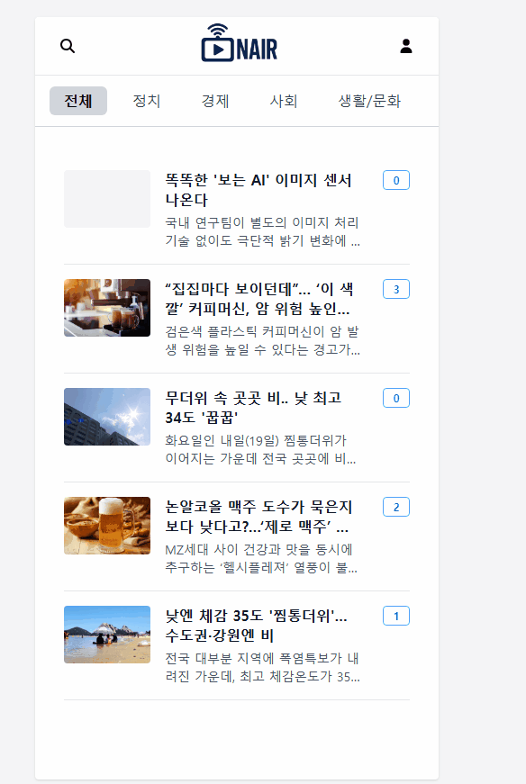&nbsp;&nbsp;&nbsp;&nbsp;&nbsp;&nbsp;&nbsp;&nbsp;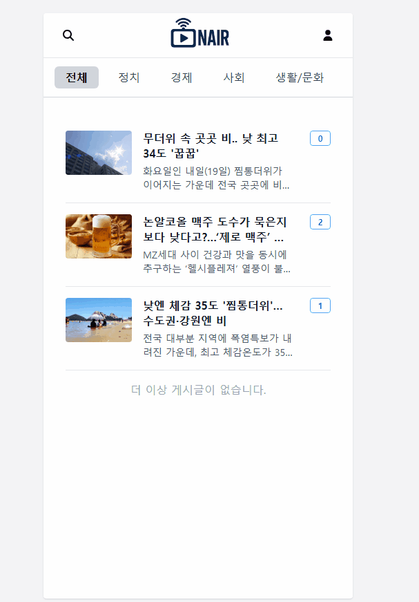
 

> 회원 탈퇴 시 30일 동안 재가입이 불가능하며, 스프링부트 스케줄러를 통해 30일 경과 시 회원 정보가 삭제됩니다.
>
> 기자만이 기사를 작성할 수 있으며, 기사에는 이미지, 카테고리, 제목, 본문을 작성할 수 있습니다. 
>
> 이미지는 amazon s3을 이용해 저장합니다.
>
> 기사 작성시 마이페이지에 본인이 작성한 글 내역이 노출됩니다.
>
> 기사 작성이 완료되면 AI 모델을 통해 해당 기사를 요약하고 요약된 내용이 노출됩니다.

#### 검색&nbsp;&nbsp;&nbsp;&nbsp;&nbsp;&nbsp;&nbsp;&nbsp;&nbsp;&nbsp;&nbsp;&nbsp;&nbsp;&nbsp;&nbsp;&nbsp;&nbsp;&nbsp;&nbsp;&nbsp;&nbsp;&nbsp;&nbsp;&nbsp;&nbsp;&nbsp;&nbsp;&nbsp;&nbsp;&nbsp;&nbsp;&nbsp;&nbsp;&nbsp;&nbsp;&nbsp;&nbsp;&nbsp;&nbsp;&nbsp;&nbsp;&nbsp;&nbsp;&nbsp;&nbsp;&nbsp;&nbsp;&nbsp;&nbsp;&nbsp;&nbsp;&nbsp;&nbsp;&nbsp;&nbsp;&nbsp;&nbsp;&nbsp;&nbsp;댓글

&nbsp;&nbsp;&nbsp;&nbsp;&nbsp;&nbsp;&nbsp;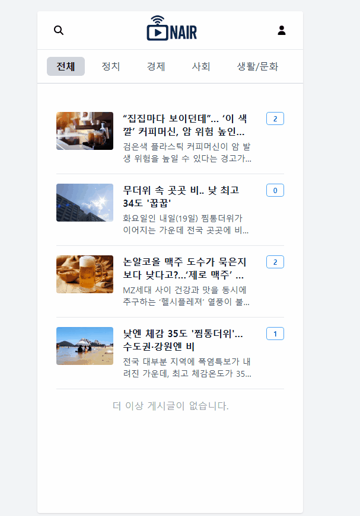
 

> 검색시 제목과 본문에 일치하는 내용이 노출됩니다.
> 
> 댓글은 2 depth까지만 작성이 지원되고, 하위 댓글이 지워지지 않은 채로 상위 댓글이 지워지면, 상위 댓글은 "삭제 처리되었습니다" 메시지만 노출됩니다.

#### 좋아요&nbsp;&nbsp;&nbsp;&nbsp;&nbsp;&nbsp;&nbsp;&nbsp;&nbsp;&nbsp;&nbsp;&nbsp;&nbsp;&nbsp;&nbsp;&nbsp;&nbsp;&nbsp;&nbsp;&nbsp;&nbsp;&nbsp;&nbsp;&nbsp;&nbsp;&nbsp;&nbsp;&nbsp;&nbsp;&nbsp;&nbsp;&nbsp;&nbsp;&nbsp;&nbsp;&nbsp;&nbsp;&nbsp;&nbsp;&nbsp;&nbsp;&nbsp;&nbsp;&nbsp;&nbsp;&nbsp;&nbsp;&nbsp;&nbsp;&nbsp;&nbsp;랭킹

&nbsp;&nbsp;&nbsp;&nbsp;&nbsp;&nbsp;&nbsp;&nbsp;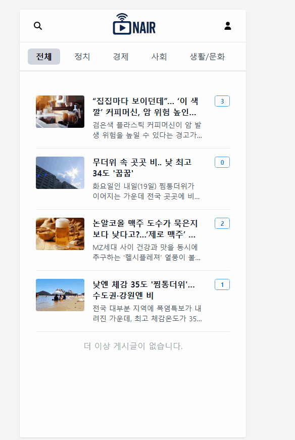 

> 본인이 마음에 드는 기사를 좋아요 기능을 통해 찜할 수 있고, 마이페이지에서 확인할 수 있습니다.
> 
>  24시간 기준으로 인기 게시글이 노출됩니다. 인기 게시글은 댓글 수, 조회수, 좋아요 수를 통해 계산됩니다.

#### 카프카 기능 테스트&nbsp;&nbsp;&nbsp;&nbsp;&nbsp;&nbsp;&nbsp;&nbsp;&nbsp;&nbsp;&nbsp;&nbsp;&nbsp;&nbsp;&nbsp;&nbsp;&nbsp;&nbsp;&nbsp;&nbsp;&nbsp;&nbsp;&nbsp;&nbsp;&nbsp;&nbsp;&nbsp;&nbsp;&nbsp;&nbsp;&nbsp;&nbsp;&nbsp;&nbsp;&nbsp;AI 요약 테스트

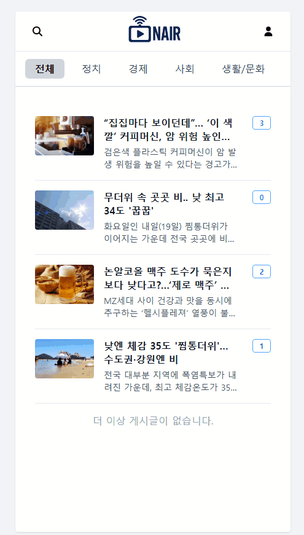&nbsp;&nbsp;&nbsp;&nbsp;&nbsp;&nbsp;&nbsp;&nbsp;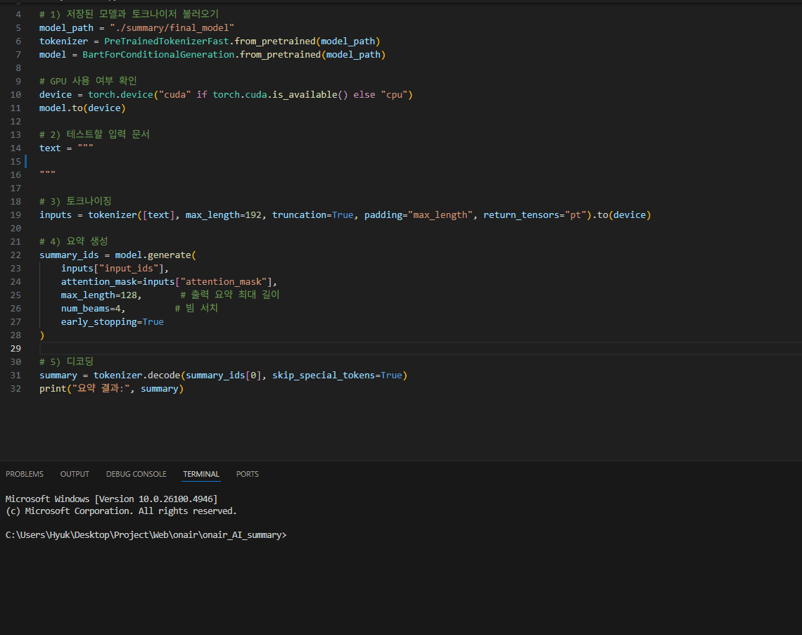 

> 구매자는 판매자의 라이브를 들어가 채팅을 할 수 있으며 거래에 대한 금액 제안을 할 수 있습니다. 그 후, 판매자 혹은 구매자는 채팅을 통해 판매를 완료하고 서로를 상호 평가할 수 있습니다.